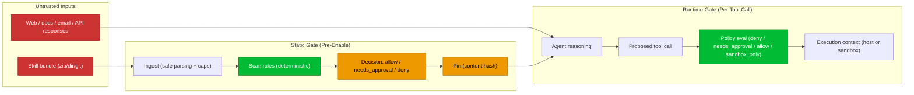

# Security Guarantees (and Non-Guarantees)

ClawGuard goal: reduce agent blast radius when using 3rd-party skills.

This is defense-in-depth:
- deterministic static scan (what the bundle *contains*)
- hash pinning (what you *approved*)
- runtime tool-call policy (what the agent *tries to do*)
- sandboxing (where actions *happen*)

## Guarantees (When Wired In)

These guarantees assume:
- you scan the bundle before enabling/using it
- your agent routes tool calls through ClawGuard policy (hook is in the loop)

ClawGuard guarantees:
- Deterministic results for a given bundle + rulepack version (no “LLM vibes” for allow/deny).
- Stable “trusted” semantics: `trusted` only applies to locally pinned (content-hash) bundles. Any change => re-review.
- Runtime enforcement: if a tool call matches a deny rule, it is blocked before execution.
- Runtime “containment” guidance: `untrusted` defaults can force `sandbox_only` (and deny host exec).

## Non-Guarantees (Be Explicit)

ClawGuard does **not** guarantee:
- “No malware”. A skilled attacker can evade regex-based static detection.
- Safety if execution happens outside the hook (direct scripts, manual `bash`, other agent runners).
- Safety after a human approves a bad action (approvals are a trust decision).
- Safety if you mount secrets / broad host paths into the sandbox.
- Safety from untrusted *content* (web pages, emails, API responses) being used to steer the model’s decisions.

## Threat Map (What Is Covered Where)

## Coverage Matrix (Practical)

| Threat / behavior | Static scan | Pinning | Runtime policy | Sandbox |
| --- | --- | --- | --- | --- |
| `curl|sh`, download+exec | blocks/flags | detects drift | blocks host exec | contains if allowed |
| Branch-tip installs (`git+…@main`) | flags | detects drift | blocks host exec | contains if allowed |
| Shell profile edits (`~/.zshrc`) | flags | detects drift | n/a unless tool call | contains if isolated |
| Persistence (`cron`, `LaunchAgents`) | flags | detects drift | can block tool calls | contains if isolated |
| Credential access commands | blocks/flags | detects drift | can block tool calls | contains if secrets not mounted |
| Prompt injection via web/API/tool output | not solvable | n/a | reduces blast radius | reduces blast radius |
| “Do anything / no confirmation” directives | flags | detects drift | approvals required | reduces blast radius |

## Default Recommendation (For Users)

Simple, honest defaults:
- Default mode: `untrusted`
- `untrusted` stance: sandbox-only + no host exec; approvals for elevated actions
- Promote to `trusted` only after scan + human review + pin

